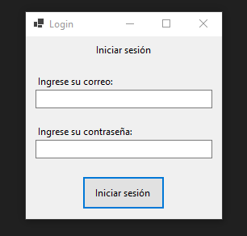
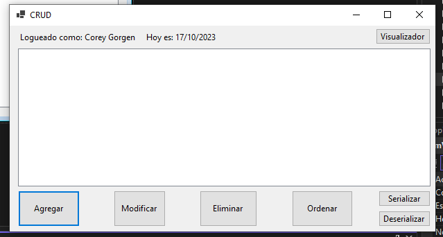
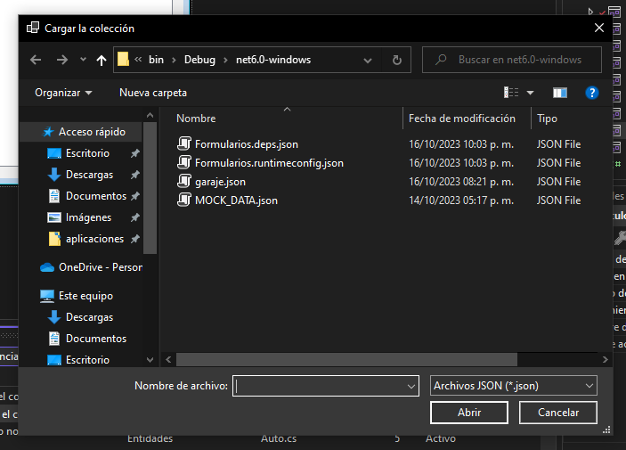

# CRUD - Vehicles (1st midterm exam)

WinForms app for managing a collection of vehicles in a garage: create, read, update, and delete
records through a desktop UI. Built as the first midterm exam for Laboratorio II at UTN.

## Features

- Login screen, credentials checked against a JSON user file
- Access log viewer
- Save/load vehicle data via JSON serialization
- Add, edit, delete, and sort vehicles
- Confirmation prompt on exit

## Stack

C# WinForms (.NET 6), Newtonsoft.Json

## Screenshots

| Login | CRUD | Access log |
|---|---|---|
|  |  |  |

| Serialize | Deserialize | Sort |
|---|---|---|
|  |  |  |
